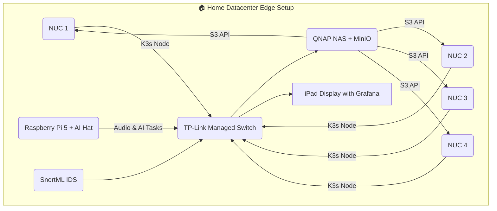

## Project Overview

This project is a homelab edge datacenter with `k3s` deployed, hosting a voice-enabled 3D assistant and other open-source components. It emphasizes **recycled hardware**, **self-hosted sovereignty**, and **cost-efficient infrastructure** for real-time AI and monitoring workloads.

<table>
  <tr>
    <td></td>
    <td></td>
  </tr>
</table>

## 🧱 Hardware & Edge Datacenter Composition

This Mini-Datacenter is composed of:

### 🧠 Compute
- 4× Intel NUCs (reconditioned)
- 1× Raspberry Pi 5 + AI Hat Kit (Optimized for CNN inference acceleration)

### 🗄️ Storage
- 1× Reconditioned QNAP NAS with:
  - 6× HDD drives
  - MinIO as S3-compatible storage backend

### 🌐 Networking
- TP-Link Smart Managed Switch (VLANs and isolation)

### 🛡️ Security & Monitoring
- SnortML IDS (experimental setup for Zero-Day threat detection)
- Prometheus + Grafana stack for real-time observability
- Dashboard on recycled iPad (Grafana front)

## 📊 Mermaid Diagram



## Project Structure

```
.
├── examples
│   ├── transcription
│   │   ├── whisper.py
│   │   └── youtube_wav_fetcher.py
├── manifests
│   ├── minio
│   ├── monitoring
│   ├── ollama
│   └── whisper
├── src
│   ├── backend
│   │   └── watchservice
│   │       └── main.py
│   ├── frontend
│   │   ├── components
│   │   │   ├── Avatar.jsx
│   │   │   └── Experience.jsx
│   │   ├── App.jsx
│   │   └── main.jsx
├── text-to-speech-webgpu
│   ├── src
│   │   ├── App.jsx
│   │   └── main.jsx
│   └── index.html
├── package.json
└── README.md
```

## Ollama Query example

```bash
curl http://localhost:11434/api/pull -d '{
  "name": "smollm:135m"
}'

curl http://localhost:11434/api/generate -d '{
  "model": "smollm:135m",
  "prompt": "What is your name"
}'
```

## Installation / Management of Solr On Kubernetes

https://dan-niles.medium.com/setting-up-apache-solr-on-kubernetes-with-rancher-desktop-931433d8f56b

## 3D Assistant in three.js

The 3D assistant is built using **three.js** and **react-three-fiber**, featuring an animated avatar that lip-syncs and responds to user inputs.

### Key Components
- `Avatar.jsx`: Manages 3D avatar animations and lip sync.
- `Experience.jsx`: Orchestrates the scene, lights, and environment.

### Run Locally
```bash
cd src/frontend
npm install
npm run dev
```

## Exploring Openvoice OS in the upcoming weeks

Openvoice OS provides a self-hosted voice assistant backend for speech recognition and responses.
